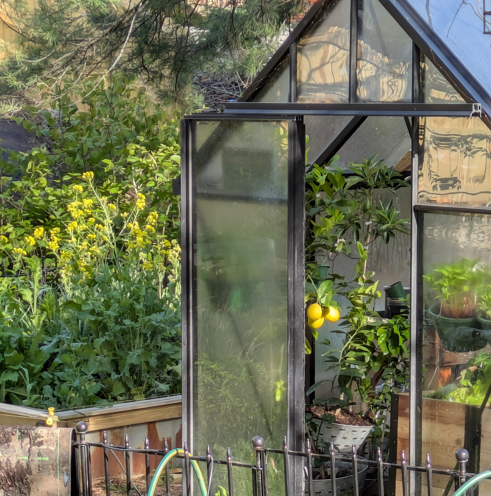

Mark your calendar for **Saturday, October 3 from 3p - 5p** in my Garden!

Once I started fully embracing the six season approach for the kitchen garden, the concept of warm season vs cool season herbs and flowers really clicked in place. So I'm thrilled to have this smaller plant givewaway in the Fall. Smaller because most people are not doing kitchen garden overwintering, but important all the same for our kitchen herbs and our autumn perennials that want to sleep all winter!

**Ordering Plants**

- You’ll receive **immediate confirmation** after placing your order
- Your confirmation email will list **exactly what you ordered**
- If a plant becomes unavailable while you’re shopping, that will be clearly noted
- An **email address is required**, so I can track and prepare each order accurately

**What to Expect this Year**

Since I'm already planning a six season harvest this year, it's easy for me to know at least the basics of what I'll be seeding in August. More perennials will most likely be added later. The selected herbs will be fine to plant outside.
\
**IF early seeding goes well, below is what you can expect on the order form to be released on September 12*.\
\
*Vegetables*\
Cold Hardy Lettuce\
Kale

*Native Pollinators*\
Yarrow - Establishes quickly, very forgiving\
Penstemon  - Excellent fall transplant success\
Native Prairie Tall Clumping Grass (Panicum Virgatum) - Hardy native grass that supports pollinators and is drought tolerant

*Cool Season Herbs*\
Cilantro - thrives in cool weather; bolts fast in heat\
Parsley - Very cold-tolerant; often overwinters\
Dill - best flavor in spring/fall; bolts in summer heat
