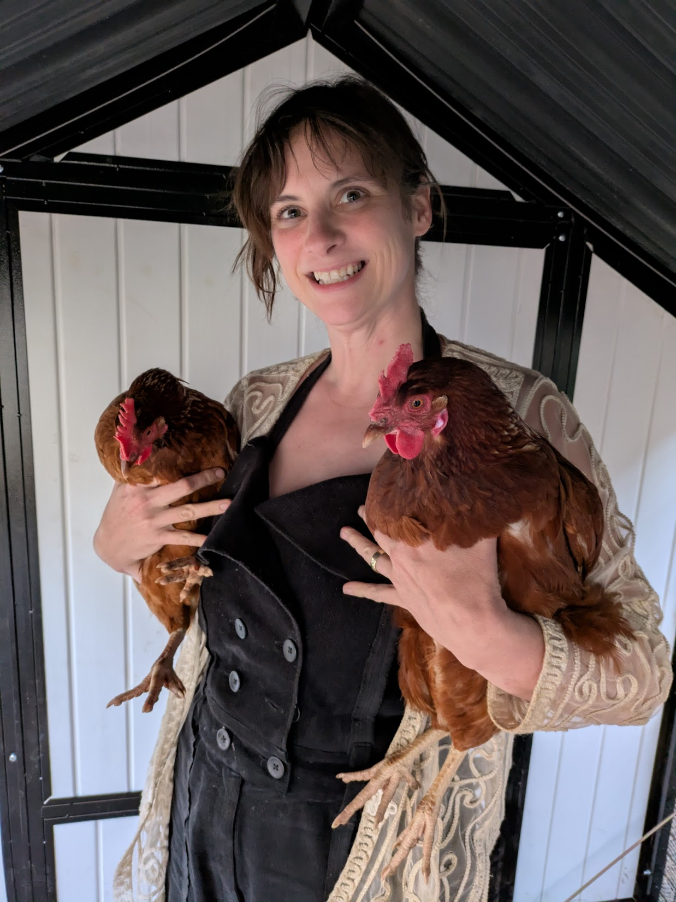

# Kitchen Garden Master Plan

**Zone 7b · Heated Greenhouse · Hoop, Square, Stone & Creek Beds**  
_Last frost ~ April 15 · First frost ~ Oct 25_

This harvest plan is sized for ~8 adults and a preservation buffer.

---

## LEGEND
**Bed Stages**  
A = Early Producer  
B = Placeholder / Bridge  
C = Summer Anchor  
D = Succession Filler  
E = Fall Establishment  
F = Winter Holding

**Crop Role**
🥗 Everyday Eating
🙂 Celebration Crop

**Kitchen Garden Raised Beds**
- **HB1, HB2** = Hoop Beds (30 sq ft each)
- **SB1, SB2** = Square Beds (60 sq ft each)
- **STB1, STB2** = Stone Beds (15 sq ft each)
- **CB1, CB2** = Creek Beds (15 sq ft each)

---

# Planting Calendar
*(Strict calendar order — greenhouse and direct-seeded actions interleaved)*

| When you act | Crop | Start / Sow | 12-cell trays (GH) | GH → Outdoors | Bed(s) | Stage | Plants | Sq Ft | Role |
|---|---|---|---|---|---|---|---|---|---|
| **Jan (mid–late)** | Lettuce (spring) | Start in GH | 18–22 trays | Feb–Mar | HB1, HB2, SB1, SB2, CB1, CB2 | A | 260–320 | 80–95 | 🥗 |
| Jan (mid–late) | Celery | Start in GH | 4–5 trays | Apr (after frost risk) | CB1, CB2, HB2 | D | 45–60 | 45–60 | 🥗 |
| Jan (late) | Peppers | Start in GH | 4 trays | May 1–15 | SB1, SB2 | C | 36–42 | 75–90 | 🥗 |
| **Feb (early)** | Eggplant | Start in GH | 1 tray | May 5–20 | SB1 | C | 6–8 | 12–16 | 🙂 |
| Feb (early) | Broccoli | Start in GH | 2 trays | Mar–Apr | SB2, HB2 | E | 20–24 | 35–40 | 🥗 |
| Feb (early) | Cauliflower | Start in GH | 3 trays | Mar–Apr | SB2, HB2 | E | 28–32 | 60–70 | 🥗 |
| Feb (early) | Brussels sprouts | Start in GH | 1 tray | Mar–Apr | SB1 | E | 6–8 | 15–20 | 🙂 |
| **Feb (mid)** | Peas | Direct |  | — | HB1 edges, CB1, CB2 | A | 160–200 | 40–50 | 🥗 |
| **Feb (late)** | Radishes (spring) | Direct |  | — | HB1, HB2, SB1, SB2, CB1, CB2 | A | 350–500 | 25–30 | 🥗 |
| **Mar (early)** | Potatoes (early) | Direct (barrels) |  | — | Barrels | C | 15–20 | — | 🥗 |
| **Mar (mid)** | Potatoes (mid) | Direct (barrels) |  | — | Barrels | C | 15–20 | — | 🥗 |
| **Apr (early)** | Fennel | Start in GH | 2 trays | Late Apr–May | CB1, CB2 | D | 16–20 | 15–20 | 🙂 |
| **Apr (mid)** | Tomatoes | Start in GH | 3 trays | Apr 20–May 5 | SB1, SB2 | C | 28–32 | 110–120 | 🥗 |
| **May (early)** | Corn | Direct |  | — | STB1, STB2 | C | 36–40 | 30 | 🙂 |
| **May (mid)** | Bush beans | Direct |  | — | STB1, STB2, CB1, CB2 | D | 120–160 | 40–45 | 🥗 |
| May (mid) | Okra | Direct |  | — | STB1, STB2 | C | 24–28 | 30 | 🥗 |
| **May (late)** | Pole beans | Direct |  | — | STB1 | C | 24–32 | — | 🥗 |
| **June (early)** | Cantaloupe | Start in GH | 1 tray | Mid–late June | SB1, SB2 edges | C | 6–8 | 30–40 | 🙂 |
| **July (mid)** | Kale (fall) | Start in GH | 4–5 trays | Aug | HB1, HB2, SB2, CB1, CB2 | E | 45–55 | 30–35 | 🥗 |
| **July (late)** | Carrots (winter) | Direct |  | — | HB1, HB2, SB2 | E | 1,200–1,800 | 70–85 | 🥗 |
| **Aug (early)** | Lettuce (fall) | Start in GH | 14–18 trays | Aug–Sept | HB1, HB2, CB1, CB2 | E | 200–260 | 55–65 | 🥗 |
| **Aug (mid)** | Turnips | Direct |  | — | HB1, HB2, SB1, SB2, STB1, STB2, CB1, CB2 | D | 180–260 | 45–55 | 🥗 |
| **Aug (mid)** | Pumpkins | Transplant |  | Late May–June | SB1, SB2 edges | C | 3–4 | 80–100 | 🙂 |
| **Sept (early)** | Radishes (winter) | Direct |  | — | HB1, HB2, STB1, STB2, CB1, CB2 | E | 300–450 | 30–40 | 🥗 |
| **Nov (early)** | Garlic | Direct (plant cloves) |  | — | Any open bed | F | 220–300 | 60–70 | 🥗 |

---

# Harvesting Calendar
*(Food flow + bed occupancy view)*

| Harvest window | Crop | Bed(s) | Stage | Plants / Sq Ft | Role |
|---|---|---|---|---|---|
| Mar–Apr | Lettuce (spring) | HB1, HB2, SB1, SB2, CB1, CB2 | A | 260–320 / 80–95 | 🥗 |
| Mar–Apr | Radishes (spring) | HB1, HB2, SB1, SB2, CB1, CB2 | A | 350–500 / 25–30 | 🥗 |
| Apr–May | Peas | HB1 edges, CB1, CB2 | A | 160–200 / 40–50 | 🥗 |
| May–June | Early potatoes | Barrels | C | 15–20 plants | 🥗 |
| June–July | Broccoli + Cauliflower | SB2, HB2 | E | 48–56 / 95–110 | 🥗 |
| June–Sept | Tomatoes | SB1, SB2 | C | 28–32 / 110–120 | 🥗 |
| July–Aug | Corn | STB1, STB2 | C | 36–40 / 30 | 🙂 |
| July–Sept | Beans (all) | STB1, STB2, CB1, CB2 | D/C | 140–190 / 40–45 | 🥗 |
| July–Sept | Okra | STB1, STB2 | C | 24–28 / 30 | 🥗 |
| July–Sept | Cantaloupe | SB1, SB2 edges | C | 6–8 / 30–40 | 🙂 |
| July–Oct | Peppers | SB1, SB2 | C | 36–42 / 75–90 | 🥗 |
| Aug–Sept | Potatoes (mid/late) | Barrels | C | 15–20 plants | 🥗 |
| Sept–Oct | Turnips | All beds | D | 180–260 / 45–55 | 🥗 |
| Sept–Oct | Pumpkins | SB1, SB2 edges | C | 3–4 / 80–100 | 🙂 |
| Oct–Feb | Kale | HB1, HB2, SB2, CB1, CB2 | F | 45–55 / 30–35 | 🥗 |
| Oct–Feb | Carrots | HB1, HB2, SB2 | F | 1,200–1,800 / 70–85 | 🥗 |
| Oct–Jan | Winter radishes | HB1, HB2, STB1, STB2, CB1, CB2 | F | 300–450 / 30–40 | 🥗 |
| Late May–June | Garlic | Any bed | B | 220–300 / 60–70 | 🥗 |

---

---

## Our Backyard Chickens

## 🥚 Egg Production 
*6 adult laying hens, no supplemental winter lighting*

| Season | Eggs per week (total flock) | What this looks like |
|---|---|---|
| **Spring** | ~24–30 eggs | 2–2½ dozen most weeks |
| **Summer** | ~18–24 eggs | 1½–2 dozen; heat may cause dips |
| **Fall** | ~12–18 eggs | About 1–1½ dozen |
| **Winter** | ~6–12 eggs | Half to one dozen (no lights) |
