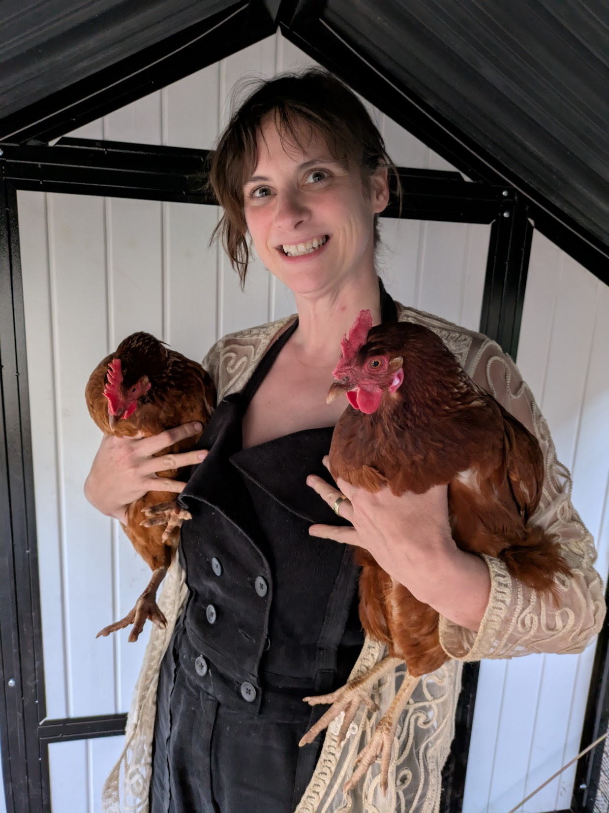

# Kitchen Garden Master Plan

**Zone 7b · Heated Greenhouse · Hoop, Sun, Creek, Stone & Barrel Beds**

---

## Planting & Harvest Schedule

<table>
<thead>
<tr><th>Crop</th><th>GH Start</th><th>Direct Seed</th><th>Bed Transplant</th><th>Harvest</th></tr>
</thead>
<tbody>
<tr><td>Lettuce</td><td>Jan</td><td></td><td>March → fence pots</td><td>Year round</td></tr>
<tr><td>Celery</td><td>Jan</td><td></td><td>May</td><td></td></tr>
<tr><td>Peppers</td><td>Jan</td><td></td><td>May → big pots</td><td>July–Oct</td></tr>
<tr style="background:#cce5f5"><td>Eggplant</td><td>Feb</td><td></td><td>Late May → Sun 2</td><td></td></tr>
<tr style="background:#cce5f5"><td>Broccoli</td><td>Feb</td><td></td><td>March → Hoop 1</td><td></td></tr>
<tr style="background:#cce5f5"><td>Cauliflower</td><td>Feb</td><td></td><td>March → Hoop 1</td><td></td></tr>
<tr style="background:#cce5f5"><td>Brussels sprouts</td><td>Feb</td><td></td><td>March → Creek 2</td><td>Sept</td></tr>
<tr style="background:#cce5f5"><td>Peas</td><td></td><td>Late Feb</td><td>garage wall</td><td>April–May</td></tr>
<tr style="background:#cce5f5"><td>Radishes (spring)</td><td></td><td>Late Feb</td><td>Hoop 2 / Stone 1</td><td>March–April</td></tr>
<tr style="background:#cce5f5"><td>Potatoes</td><td></td><td>March</td><td>Barrels</td><td>July</td></tr>
<tr style="background:#fce4ec"><td>Fennel</td><td>April</td><td></td><td>May → Creek 1</td><td>July</td></tr>
<tr style="background:#fce4ec"><td>Tomatoes</td><td>April</td><td></td><td>May → Sun 2</td><td>July–Oct</td></tr>
<tr style="background:#fce4ec"><td>Zucchini</td><td>April</td><td></td><td>May → Hoop 2</td><td>July–Sept</td></tr>
<tr style="background:#fce4ec"><td>Corn</td><td></td><td>May</td><td>Sun 1</td><td>Sept</td></tr>
<tr style="background:#fce4ec"><td>Bush beans</td><td></td><td>May</td><td>fence pots</td><td></td></tr>
<tr style="background:#fce4ec"><td>Okra</td><td></td><td>mid-May</td><td></td><td></td></tr>
<tr style="background:#fce4ec"><td>Pole beans</td><td></td><td>May</td><td>trellis by holly</td><td></td></tr>
<tr style="background:#dcedc8"><td>Cantaloupe</td><td>June</td><td></td><td>Late June → trellis by Hoop 1</td><td>Sept</td></tr>
<tr style="background:#dcedc8"><td>Kale</td><td>July</td><td></td><td>Aug → Hoop 1</td><td>Oct–Feb</td></tr>
<tr style="background:#e8d5a3"><td>Carrots</td><td></td><td>Aug</td><td></td><td></td></tr>
<tr style="background:#e8d5a3"><td>Lettuce (fall)</td><td>Aug</td><td></td><td>Aug</td><td>Oct–Jan</td></tr>
<tr style="background:#e8d5a3"><td>Radishes (fall)</td><td></td><td>Aug</td><td></td><td>Oct–Jan</td></tr>
<tr style="background:#e8d5a3"><td>Turnips</td><td>Aug</td><td></td><td></td><td>Sept–Nov</td></tr>
<tr style="background:#ffd9a0"><td>Garlic</td><td></td><td>Nov</td><td></td><td>June</td></tr>
</tbody>
</table>

---

## Fruit & Perennial Harvest

| Crop | Harvest |
|---|---|
| Serviceberries | May |
| Strawberries | May |
| Blueberries | June |
| Blackberries | July |
| Lavender | July |
| Choke berries | Aug |
| Elder berries | Aug |
| Apples | Sept |
| Figs | Sept–Oct |

---

## Our Backyard Chickens

## Egg Production
*6 adult laying hens, no supplemental winter lighting*

| Season | Eggs per week (total flock) | What this looks like |
|---|---|---|
| **Spring** | ~24–30 eggs | 2–2½ dozen most weeks |
| **Summer** | ~18–24 eggs | 1½–2 dozen; heat may cause dips |
| **Fall** | ~12–18 eggs | About 1–1½ dozen |
| **Winter** | ~6–12 eggs | Half to one dozen (no lights) |
