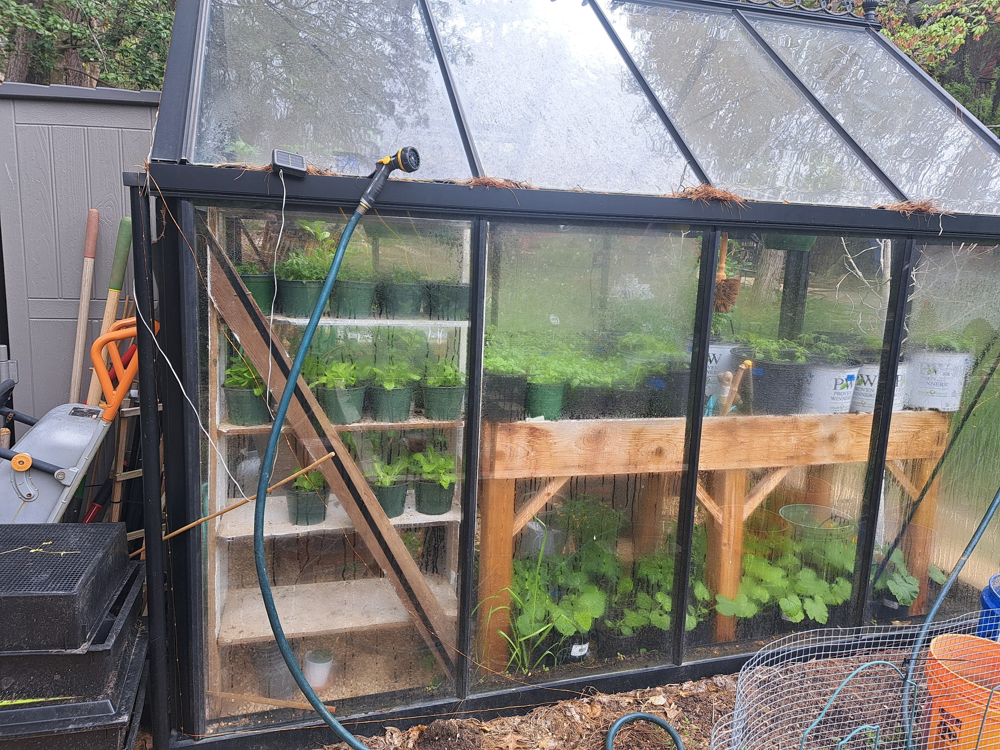
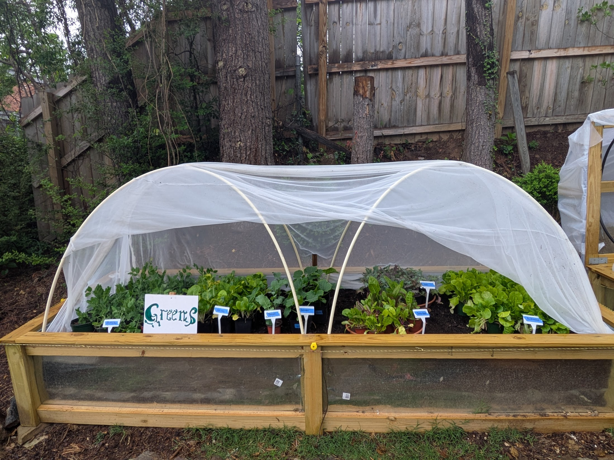

**This is a celebratory 5 year anniversary of the Greenhouse Plant Giveaway!**

Mark your calendar for **Saturday, May 3 from 3p - 5p** in my Garden!

There's a deep value for me that regardless of the bigger world's distractions, there's a joyful community sharing experience that I can offer each Spring, and now Fall also! We are so fortunate to live in such a robust neighborhood, full of loving kindness, and sure, the occasional spat as well :) But we know each other, speak with each other, and value each other's humanness. 

In that space, I'm so glad to offer another plant season to neighbors and friends. Each plant listing available for this Spring includes cooking suggestions and a link with growing tips.

**Ordering Plants**

- You’ll receive **immediate confirmation** after placing your order
- Your confirmation email will list **exactly what you ordered**
- If a plant becomes unavailable while you’re shopping, that will be clearly noted
- An **email address is required**, so I can track and prepare each order accurately

**What to Expect this Year**

Each year, I get a little more experience for what works in this region, and I learn from mistakes. Last year I learned that cuttings are trickier than I thought. My apologies to those who had unsuccessful cuttings. I also got better insight for the differences between warm and cool season veggies and herbs. This year I'm honing my offerings to be a shorter but more popular list of vegetables, pollinator flowers, and cottage annuals.\
\
**IF early seeding goes well, below is what you can expect on the order form to be released on March 28**.\
\
*Vegetables*\
Lettuce\
Sweet Peppers\
Hot Fish Peppers\
Purple Cherokee Tomatoes (slicers)\
Lost Marbles Cherry Tomatoes\
Zucchini\
Mid-June Pick-Up: Sugar Baby Pumpkins (need large space)\
Mid-June Pick-Up: Butternut (need trellis)\
Mid-June Pick-Up: Cantaloupe (need trellis)

*Native Pollinators*\
Ironweed (Vernonia)\
Lobelia Cardinalis\
Garden Phlox\
Rudbeckia\
Swamp Milkweed

*Cottage Annuals*\
Calendula (will often self-seed if left)\
Celosia\
Snapdragons\
Hibiscus Luna Mix\
Hot Mix Zinnia (will often self-seed if left)\
Penstemon ‘Electric Blue’

*Warm Season Herbs*
Thai Basil\
Genovese Basil\
Lemon Basil\
Holy Basil (Tulsi)\
Summer Savory\
Oregano\
Thyme\
Purple Culinary Sage
