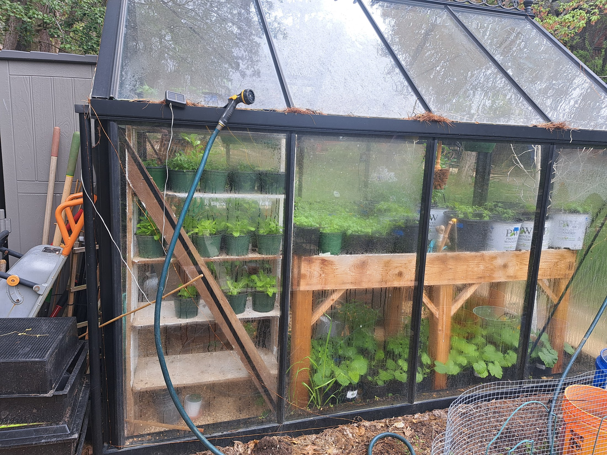
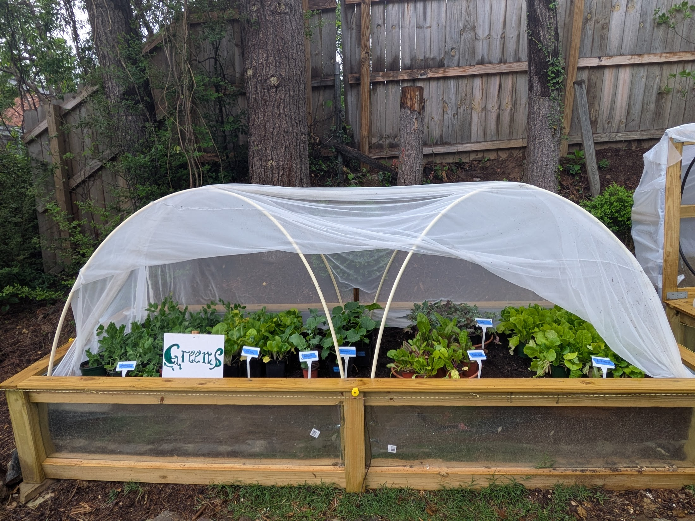

**This is a celebratory 5 year anniversary of the Greenhouse Plant Giveaway!**

Mark your calendar for **Saturday, May 2 from 3p - 5p** in my Garden!

There's a deep value for me that regardless of the bigger world's distractions, there's a joyful community sharing experience that I can offer each Spring and Fall. We are so fortunate to live in such a robust neighborhood, full of loving kindness, and sure, the occasional spat as well :) But we know each other, speak with each other, and value each other's humanness. 

In that space, I'm so glad to offer another plant season to neighbors and friends. 

**Ordering Plants**

- You’ll receive **immediate confirmation** after placing your order
- Your confirmation email will list **exactly what you ordered**
- If a plant becomes unavailable while you’re shopping, that will be clearly noted
- An **email address is required**, so I can track and prepare each order accurately

**The order form will be released at 11am on Saturday, March 28**.
[Reservation Form live at 11a March 28!]()